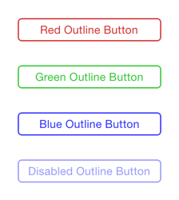

RCROutlineButton
================

An iOS `UIButton` subclass with an outline border whose colour matches that of the title label, updating appropriately when the button is disabled or pressed.

## What it Depends on

`RCROutlineButton` has been verified as working with Xcode 6.1, iOS 7.1 and iOS 8.1.

All code uses ARC.

## How to Use it

Add the `RCROutlineButton` folder and code to your project. You can then use the button programmatically or via Interface Builder as you would any other `UIButton`.

The simplest way to use `RCROutlineButton` is with Interface Builder.

First, drag a regular `UIButton` out into your view. Then, using the Identity Inspector, set the button’s class to be `RCROutlineButton`. Finally, using the Attributes Inspector, change the type of the button to be ‘Custom’.

You can then customize the button’s title font and text colour as usual. The button’s outline border will be the same colour as its title text.

If you want to customize the button’s corner radius and border width, you can do this using the corresponding fields in the Outline Button section of the Attributes Inspector.

Examples of using `RCROutlineButton` with Interface Builder in this way can be seen in the sample project.

## Sample Project

A sample project containing examples of buttons can be found in the `RCROutlineButtonSample` folder.

## License

MIT License (see `LICENSE` in the root of the repository).
